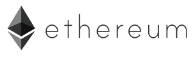

&nbsp;&nbsp;&nbsp;

The 0xcert Framework is a free and open-source JavaScript library that provides tools for building powerful decentralized applications. Our mission is to equip application developers with a secure, agnostic and opinionated framework with conventions to enable interoperability between applications.

To learn more about the 0xcert Framework, the Protocol, and the 0xcert news, please refer to:
* [The 0xcert Framework documentation](https://docs.0xcert.org/).
* [The 0xcert Framework repository](https://github.com/0xcert/framework/): please consider contributing to the open-source and free framework,
* [The official 0xcert website](https://0xcert.org/),
* [Our news blog](https://0xcert.org/news/).

| Package | Version | Description
|-|-|-
| 0xcert/cert |  | Module for certifying asset data objects.
| 0xcert/conventions |  | Module with implementation of all confirmed conventions.
| 0xcert/ethereum-asset-ledger |  | Asset ledger module for asset management on the Ethereum blockchain.
| 0xcert/ethereum-erc20-contracts |  | Smart contract implementation of the ERC-20 standard on the Ethereum blockchain.
| 0xcert/ethereum-erc721-contracts |  | Smart contract implementation of the ERC-721 standard on the Ethereum blockchain.
| 0xcert/ethereum-generic-provider |  | Basic implementation of communication provider for the Ethereum blockchain.
| 0xcert/ethereum-http-provider |  | Implementation of HTTP communication provider for the Ethereum blockchain.
| 0xcert/ethereum-metamask-provider |  | Implementation of MetaMask communication provider for the Ethereum blockchain.
| 0xcert/ethereum-order-gateway |  | Order gateway module for executing atomic operations on the Ethereum blockchain.
| 0xcert/ethereum-order-gateway-contracts |  | Smart contracts used by the order gateway on the Ethereum blockchain.
| 0xcert/ethereum-proxy-contracts |  | Proxy smart contracts used by the order gateway when communicating with the Ethereum blockchain.
| 0xcert/ethereum-sandbox |  | Test server for local running testing of modules on the Ethereum blockchain.
| 0xcert/ethereum-utils |  | General Ethereum utility module with helper functions for the Ethereum blockchain.
| 0xcert/ethereum-utils-contracts |  | General utility module with helper smart contracts.
| 0xcert/ethereum-value-ledger |  | Value ledger module for currency management on the Ethereum blockchain.
| 0xcert/ethereum-xcert-contracts |  | Smart contracts used by the Asset ledger on the Ethereum blockchain.
| 0xcert/merkle |  | Implementation of basic functions of binary Merkle tree.
| 0xcert/scaffold |  | Overarching module with types, enums, and interfaces for easier development of interoperable modules.
| 0xcert/utils |  | General utility module with common helper functions.
| 0xcert/vue-example | - | VueJS plug-in example for NuxtJS.
| 0xcert/vue-plugin |  | Implementation of VueJS plug-in.
| 0xcert/webpack | - | Module for package building and minification.

## Supporter blockchain

See [CONTRIBUTING](https://github.com/0xcert/suite/blob/master/CONTRIBUTING.md) to learn how to contribute to the project and [LICENSE](https://github.com/0xcert/suite/blob/master/LICENCE) to learn about the terms of use.
