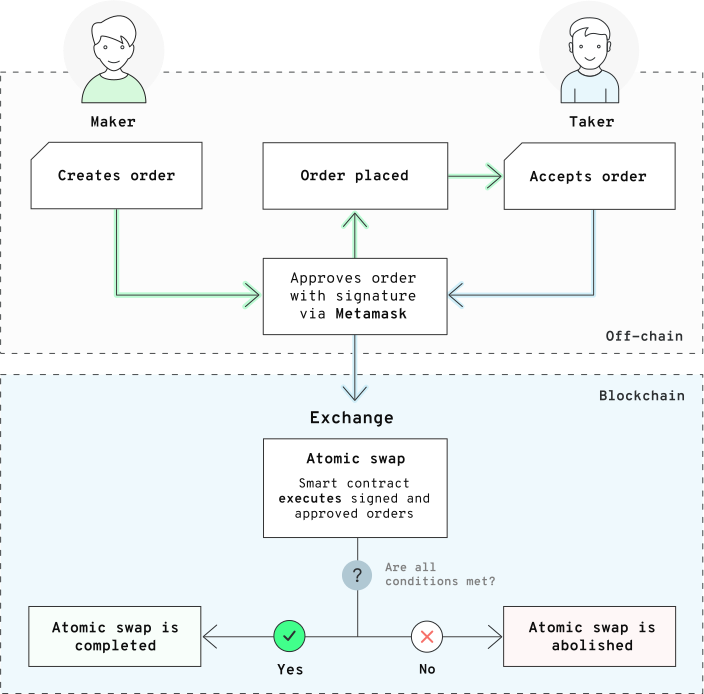

# Atomic orders

If you want to exchange assets with someone in a trustless way without a third party involvement and with no risk of asset loss, atomic orders are the way to go.

Atomic order is a way of creating an atomic swap within the 0xcert Framework. It is a set of instructions for what you will execute in a single mutation and with only two possible results. Either the mutation will succeed and all participants will receive their assets, or the mutation will fail and the operation will return to its starting point.

## How it works

Atomic swap operation is always an order between a maker and a taker, and multiple parties can represent either side. A maker is the one who creates an order, signs it and sends it to the taker, who in turn executes the order and pays the execution fee.



Multiple actions can be performed in such a manner. For now, you can transfer assets, transfer values, and create new assets. Using atomic orders provides multiple advantages apart from trustlessness and safety. With them, you can delegate paying storage fees to another user as well as delegate the time when a mutation should be made.

The 0xcert Framework provides automatization to ensure that a specific agreement between multiple parties is reached. There are only two possible endpoints for an atomic swap:

* Successful completion of the trade for all parties involved or
* Abolition of the process and returning to the starting point if the swap operation encounters issues in its settlement.

There is no middle ground for an atomic swap outcome which reduces the possibility of one party taking unfair advantage over the other.

Atomic swaps are performed through the Order Gateway structure which is permanently deployed on the platform and publicly available to everyone. A fixed sequence of required steps and conditions is secured by cryptography embedded in the order gateway. Once all steps are completed, the swap is confirmed and successfully settled. If not, the atomic swap process is abolished and canceled, with no damage to the assets that were subject to swap.

While the trade agreement is created in an off-chain environment between trading parties, the settlement of the trade done by atomic swap is performed entirely on the storage. This makes every single step of the operation trackable and verifiable.

## Installation

We recommend you employ the package as an NPM package in your application.

```shell
$ npm i --save @0xcert/ethereum-order-gateway
```

On our official [GitHub repository](https://github.com/0xcert/framework), we also host compiled and minimized JavaScript files that you can directly include in your website. Please refer to the [API](https://docs.0xcert.org/api/core.html) section to learn more about order gateway.

## Usage overview

To demonstrate the greatness of atomic swap operations, we will transfer an already existent asset to a new wallet, and create a new asset and send it to our main wallet, all within a single mutation. First, we have to prepare the state that will allow us to execute our plan.

These guidelines assume that you have followed the complete guide and taken all the steps from both [Certification](https://docs.0xcert.org/guide/certification.html) and [Asset management](https://docs.0xcert.org/guide/asset-management.html) sections, where we created a new asset with the ID `100`. For the purpose of this guide, make sure you have opened two MetaMask accounts. In this example, we'll name the second account as `0xF9196F9f176fd2eF9243E8960817d5FbE63D79aa`, you may change this value if you find it more appropriate.

As usual, we first import a module into the application. This time, we import the `OrderGateway` class which represents a wrapper around a specific pre-deployed structure on the Ethereum network.

```ts
import { OrderGateway } from '@0xcert/ethereum-order-gateway';
```

Then, we create a new instance of the `OrderGateway` class with an ID that points to a pre-deployed order gateway on the Ethereum Ropsten network (this option can also be configured in the provider).

```ts
const orderGatewayId = '0xf02b2e925a1006c313e1af344821c67382777fc8';
const orderGateway = OrderGateway.getInstance(provider, orderGatewayId);
```

Now, we can define an order with two actions: the first action transfers an existing asset that we created in the [Asset management](https://docs.0xcert.org/guide/asset-management.html) section into our second MetaMask wallet. In the second action, we create a new asset with ID `200` and imprint created in the [Certification](https://docs.0xcert.org/guide/certification.html) section.

::: warning
For the purpose of simplicity of this guide, we will be both the maker and the taker of the order. For the `makerId` and `takerId`, we will employ our current MetaMask account.
:::

```ts
import { Order, OrderActionKind } from '@0xcert/ethereum-order-gateway';

const order = {
    makerId: provider.accountId,
    takerId: provider.accountId,
    actions: [
        {
            kind: OrderActionKind.TRANSFER_ASSET,
            ledgerId: assetLedgerId,
            senderId: provider.accountId,
            receiverId: provider.accountId,
            assetId: '100',
        },
        {
            kind: OrderActionKind.CREATE_ASSET,
            ledgerId: assetLedgerId,
            senderId: provider.accountId,
            receiverId: provider.accountId,
            assetId: '200',
            assetImprint: 'aa431acea5ded5d83ea45f1caf39da9783775c8c8c65d30795f41ed6eff45e1b', // we will use the same imprint we generated in the certification step
        },
    ],
    seed: Date.now(), // unique order identification
    expiration: Date.now() + 60 * 60 * 24, // 1 day
} as Order;
```

When you work on a real case, make sure to set the `takerId` correctly. If you want your colleague to execute an order, you should insert their Ethereum wallet address as the `takerId`.

The following step is made only by the maker, i.e. the person creating an order.

```ts
const signedClaim = await orderGateway.claim(order);
```

By calling the `claim` function, we sign the order. We need to send this signature to the taker, together with the `order` object via an arbitrary communication channel.

All participants in the order must unlock the transferred assets and allow the `OrderGateway` to manage them. Make sure this step is done by every party that does a transfer within order operations. In the example below, we authorize the `OrderGateway` to transfer the asset with ID `100` to another address and give it the ability to create assets.

The [API](https://docs.0xcert.org/api/core.html#asset-proof) section contains information about how to authorize the order gateway for all the assets at the same time, to avoid repeating approval for each individual asset (this is especially useful in the case of a decentralized exchange).

```ts
// approve account for transfering asset
await assetLedger.approveAccount('100', orderGateway).then((mutation) => {
    return mutation.complete();
});

// assign ability to mint
await assetLedger.assignAbilities(orderGateway, [AssetLedgerAbility.CREATE_ASSET]).then((mutation) => {
    return mutation.complete();
});
```

::: tip
Don't forget to create an instance of `assetLedger` and to import `AssetLedgerAbility`. 
:::

The following step is done only by the taker, the one that executes the order on the network and pays the execution fees. For the purpose of this guide, we define the same account for both the maker and the taker, since we are present on both sides.

```ts
const mutation = await orderGateway.perform(order, signedClaim).then((mutation) => {
    return mutation.complete();
});
```

By now, the asset with ID `100` should be present in our new wallet, while the main wallet should be left with the new asset with ID `200`.

```ts
const owner100Id = await assetLedger.getAssetAccount('100');
//=> 0x...

const owner200Id = await assetLedger.getAssetAccount('200');
//=> 0x...
```

To learn more about atomic operations, please refer to the [API](https://docs.0xcert.org/api/ethereum.html#orders-gateway) section.
