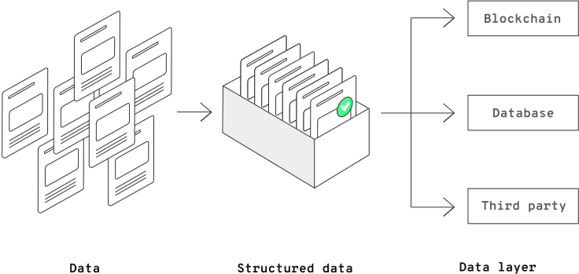
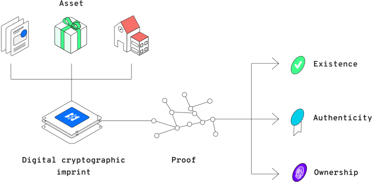

# Certification

Various industries follow different standards. A standard reflects a need for defining a certain best practice and for establishing rules in a particular process or for a specific product. Today, companies and institutions mostly define their own rules of communication, operation, processes, and format of stored and managed data. To establish more effective communication among them, the concept of system interoperability becomes increasingly valuable. As this idea develops over time, we will see companies and organizations choose interoperable systems more often.

The ERC-721 has given us an incredibly powerful standard. The 0xcert Framework is an opinionated framework that apart from the general development guidelines from the standard also provides a scaffold for defining conventions above the data objects. Each asset within the 0xcert Framework represents a JSON data object, structured based on the definitions in a data scheme based on JSON-schema.



When talking about data conventions, for example, think about what Ruby on Rails did for Ruby. 0xcert is dealing with the application layer where developers need to act in a fast and agile way. To ensure interoperability among applications in the future, the assets follow specific conventions. These will prevent incompatibility on a higher level, which might happen if every NFT issuer deploys their own version of an industry standard. Having this level of standardization built on top of the strong ERC-721 standard prevents high-level fragmentation and safeguards long-term sustainability.

## Explaining the process

When creating an asset, we start preparing a digital structure of data represented by the asset. During this process, we create a cryptographic imprint based on the asset data. Such `imprint` represents a cryptographic proof of the asset data and should thus be saved on a public blockchain or similar distributed systems so that third parties are able to use it as a public asset proof. Based on it, they can verify the proof of existence, authenticity, and ownership of these digital assets without a middleman involvement. The process of creating an asset imprint from the asset data is called certification.




The original data of an asset is usually known only to the issuer and the owner of an asset. Both can reveal a specific part of the data to a third person anytime, while a third party can verify such data based on a publicly available `imprint`. For this purpose, the issuer or the owner creates an evidence file that contains the revealed data and other proofs needed for a third party to calculate the `imprint` once more. If the calculated imprint matches the publicly available imprint, it means that the revealed data indeed exists in the original data object.

The process of certification is based on the [Merkle Tree](https://en.wikipedia.org/wiki/Merkle_tree) concept, a well-known mechanism in the world of cryptography. To create a cryptographic hash string, the 0xcert Framework employs the [sha256](https://en.wikipedia.org/wiki/SHA-2) algorithm. Within the framework, this complexity is hidden from the developer's interaction and available via simple functions provided by the API.

## Installation

We recommend you employ the certification module as an NPM package in your application.

```shell
$ npm i --save @0xcert/cert
```

On our official [GitHub repository](https://github.com/0xcert/framework), we also host a compiled and minimized JavaScript files that you can directly include in your website. Please refer to the API section to learn more about certification.

## Usage overview

In the following guide, we will create a simple asset that represents a crypto collectible. We will define a JSON data object of the asset, create its cryptographic imprint, and show how to reveal data to a third party.

To start, we create a simple JSON object that will represent our crypto collectible item. We will define the data object based on the [#88](https://github.com/0xcert/framework/blob/master/conventions/88-crypto-collectible-schema.md) convention which describes crypto collectible items. It's advised to store this data into a local database to keep its original structure and have it at our disposal in the future.

```ts
import { Object88, schema88 } from '@0xcert/conventions';

const data = {
    description: 'A weapon for the Troopers game which can severely injure the enemy.',
    image: 'https://troopersgame.com/dog.jpg',
    name: 'Magic Sword'
} as Object88;
```

In the 0xcert Framework, the whole complexity of certification is packed into the `Cert` class, therefore, we create a new instance of that class with the appropriate JSON Schema definition for our data object.

```ts
import { Cert } from '@0xcert/cert';
import { schema88 } from '@0xcert/conventions';

const cert = new Cert({
    schema: schema88,
});
```

In the previous section, we mentioned that each asset also holds its URI, pointing to the asset's publicly available metadata. We should put metadata and other public files to a publicly available HTTP location. We can either establish an HTTP server ourselves, or we can host the file through services like Amazon and Google.

At this point, we first have to decide which data we want to expose publicly and which we want to store internally. For the purpose of this guide, we choose to publicly disclose `description` and `image,` while we retain the `name` privately for us as the issuers. Based on the data object above we create a JSON object that will be published publicly.

```json
{
  "$evidence": "https://troopersgame.com/dog/evidence",
  "$schema": "http://json-schema.org/draft-07/schema",
  "description": "A weapon for the Troopers game which can severely injure the enemy.",
  "image": "https://troopersgame.com/dog.jpg"
}
```

We should thus publish this structure on a publicly accessible HTTP location. Along with the metadata file, we usually publish the evidence file, too, that proves data validity of this publicly published JSON file.

The example above already assumes that we host the evidence file on the location `https://troopersgame.com/dog/evidence` which means that we should publish the appropriate content there (we thus change this location to match its true location). We create the evidence data using the `disclose` method where we list the JSON data paths that we want to expose.

```ts
const evidence = await cert.disclose(exampleData, [
    ['description'],
    ['image'],
]);
// => [{ path, nodes, values }, ...]
```

The content that is obtained with the function above can now be published on the said HTTP location, the same way as we did it for the asset metadata (`data` carries the content of the `evidence` variable in the above example).

```json
{
    "$schema": "http://json-schema.org/draft-07/schema",
    "data": [
        {
            "path": [],
            "nodes": [
                {
                    "index": 1,
                    "hash": "e3b0c44298fc1c149afbf4c8996fb92427ae41e4649b934ca495991b7852b855"
                },
                {
                    "index": 3,
                    "hash": "e3b0c44298fc1c149afbf4c8996fb92427ae41e4649b934ca495991b7852b855"
                },
                {
                    "index": 8,
                    "hash": "fe57a125a8377ddd78ac9e8000b3cc7bf695601d1c194192e12cac46e3005c97"
                }
            ],
            "values": [
                {
                    "index": 2,
                    "value": "A weapon for the Troopers game which can severely injure the enemy."
                },
                {
                    "index": 3,
                    "value": "https://troopersgame.com/dog.jpg"
                }
            ]
        }
    ]
}
```

We can now create a cryptographic proof for our crypto collectible that we will need in the following sections of this guide.

```ts
const imprint = await cert.imprint(data);
// => aa431acea5ded5d83ea45f1caf39da9783775c8c8c65d30795f41ed6eff45e1b
```

This long string returned by the `imprint` method represents a cryptographic proof of the original asset data object. We will store this string on the Ethereum chain in one of the following sections where we'll show how to handle asset ledgers.

Let's further discuss the concept of revealing the data to third parties. This works in the same way as we created the evidence file for publicly published metadata JSON file. When we want to reveal a private `name` data to a third person, we would also employ the `disclose` function to create the evidence data, send it to a third person via arbitrary communication channel allowing them to calculate the `imprint` of the original data object based on the revealed data and received evidence data. If the calculated imprint matches the one that is publicly available on the blockchain, the data will count as valid.

Certification offers some additional possibilities. For more details, please refer to the [API]() section.
