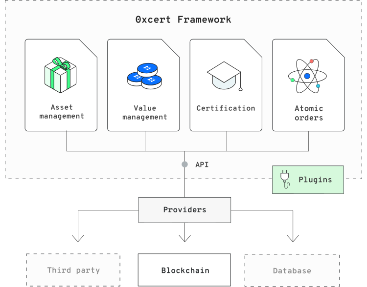
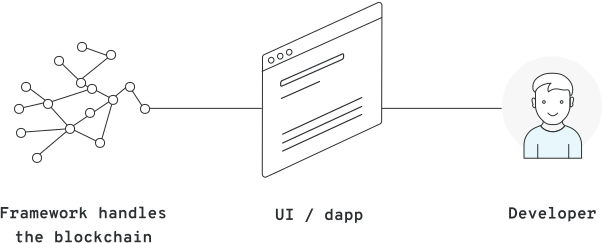

# Introduction

The 0xcert Framework is a JavaScript library that provides tools for building powerful decentralized applications (dapps).

## What is 0xcert Framework?

The 0xcert Framework enables management of **assets** and **values**.

**Assets** are non-fungible tokens (NFTs), compliant with the Ethereum's [ERC-721](https://github.com/ethereum/EIPs/blob/master/EIPS/eip-721.md) standard. Assets can represent a unique, either digital or real-life item with its unique metadata stored as a data imprint on a distributed ledger.

Management of **values**, on the other hand, deals with cryptocurrency tokens that are  compliant with the [ERC-20](https://github.com/ethereum/EIPs/blob/master/EIPS/eip-20.md) standard. Values represent fungible tokens that share the same value as any other of their kind which makes them optimal to serve as a monetary value token.

## What does it solve?

Due to the complexity of low-level blockchain solutions, the broad adoption of non-fungible tokes and blockchain, in general, is slower than it could be. The lack of conventions prevents interoperability among applications. Developers trying to develop their own decentralized application using non-fungible tokens face long development time and huge risk in their development process and security, lowering the overall efficiency and adoption rate. The resulting ecosystem of digital assets is under threat of being fragmented and of developing non-interoperable dapps for underlying data.

## Who is it for?

Our mission is to equip application developers with a secure and agnostic framework for building modern decentralized applications (dapps). 0xcert is a pluggable settlement with an advanced integration layer for different dapps and relay applications.

This enables developers to focus on the application layer and quickly build dapps for issuing university certificates, KYC applications, applications for loyalty programs, warranties, badges, credits, or even a decentralized non-fungible exchange.

## Features

The 0xcert Framework enables an effective and multi-function library for building decentralized applications. Its core features include:

* **Management of digital or real-world tangible items:** The Framework provides a set of functions for deployment, management, certification, and verification of assets. These can hold a data imprint of an item they represent, meaning they store a cryptographic representation of data objects. Such assets can be selectively verified by any third parties to which the data are disclosed by the owner.

* **Management of digital currency:** Besides non-fungible, unique assets, the Framework also supports the management of monetary value tokens or cryptocurrencies. They are handled through common functions known in blockchain operations, i.e. transfer and management of rights.

* **Many-to-many atomic orders:** A single atomic transaction allows for creating and transferring tokens (both ERC-721 non-fungible tokens and ERC-20 fungible tokens) as many times as agreed, and among multiple participants involved. Many-to-many atomic orders allow multiple parties to participate simultaneously in a single transaction. This is one of the most potent and crucial features of the 0xcert Framework.

* **Unified experience for decentralized and distributed systems:** The goal of the 0xcert Framework is to become blockchain/platform-agnostic, without discriminating among different blockchains or other distributed systems. The whole API of the Framework is identical when used with the Ethereum blockchain, Wanchain, or any other distributed system you choose for your application. The code of the API looks completely identical and provides the exact same functionality regardless of the blockchain or distributed system you employ. This enables you to quickly and seamlessly switch between systems.

* **Data conventions:** We have set up the rules for interoperability between applications built on top of the 0xcert Framework. They are of crucial importance for adoption among businesses. Each asset data object is defined and managed by conventions that provide a unifying layer to the systems, which in turn enables different applications to communicate amongst themselves. Suggestions for new conventions are always welcome, and we invite anyone to support the development of the ecosystem. To participate, simply open a new issue on [GitHub](https://github.com/0xcert/framework/issues) and invite the interested stakeholders to provide feedback and ultimately approve a new convention.

## Use case examples

Decentralized applications can serve as a powerful improvement of operations and asset management in various industries and sectors. Among others, they can be especially useful in the following use cases:

* **Certificates:** The areas that employ certificates are often poised with massive overhead, low efficiency, and in some cases even fraud. With non-fungible tokens (NFTs), new systems can be introduced trustless and completely reduce friction (middleman, high costs, slow handling, etc.). Various certificates, ranging from ISO certificates to car insurance certificates, can become NFTs. Academic credentials can be represented as NFTs as well. These can then be used to build new systems for educational institutions or improve the existing ones. Since blockchain and NFTs have an inherent feature of immutability and comprehensive trackability, we can take fighting against academic credentials fraud as an ideal use case. Cross-border student's mobility and verification of academic credentials can be streamlined, and friction can be reduced. Credentialing within Massive Open Online Courses for Continuing Professional Development (CPD MOOCs) programs can also be addressed. Software licensing as well as paywalls can be significantly benefit from NFTs and become completely frictionless or even be introduced to a secondary market.

* **Collectibles:** This is the most prevalent and well-known use case for NFTs at the moment, popularized by CryptoKitties. Collectibles can range from simple to highly complex which involves licensing deals with clubs, leagues or brands (NFL, NBA, FIFA, Manchester United, Star Wars, Disney, etc.). There are different models where these collectibles can later be applied to. Collectibles can be in-game items (like a sword in an massively multiplayer online role-playing games (MMORPGs)) or players within a fantasy football game. High-value assets can introduce fractional ownership or leasing and renting schemes.

* **Digital art:** The growing field of digital art can significantly benefit from having unique digital representations on the blockchain. This allows for more robust control over ownership as well as provenance. By having simple tooling available, the field will be able to focus on new user experiences and significantly expand the existing digital art market. An NFT can become an ownership certificate for a specific piece of art. This would mean that it can not be forged and would provide a verifiable provenance track. Historical price and ownership movements are easily trackable, as well. Many new models can be set up, involving auction houses, appraisers or even artists directly. Furthermore, by introducing fractional ownership new secondary markets can be created.

* **Identity & KYC:** Identity is a complicated and extensive field. It is most often tied to a KYC record (based on an ID or passport). With the introduction of NFTs, identity can become a much larger system of identification or even self-sovereignty. Depending on the model, NFTs from different areas can be used together to provide some form of identity. Such identities can then be used in frictionless systems where no sign-in is required since the identification is already present in a wallet.

* **Intellectual property:** Similar to academic credentials, these areas often experience fraudulent cases. NFTs can become IP representations that are not only timestamped but also secured in someone's wallet, which is potentially highly relevant for cases disputed in the court of law. Comparable is also the case of product authentication, especially with high-value brands. Ownership over items like expensive cars and watches can now be tracked within an NFT and used as a part of the brand value or for provenance tracking.

* **Goods provenance:** As mentioned in some of the previous cases (art, collectibles), goods provenance can be highly significant. The supply chain is an industry that could greatly benefit from transparent trackability. In sensitive areas like food or pharma, the supply chain provenance becomes extremely important. With the introduction of NFTs, these can be innovated and streamlined.

## Our vision

The vision of 0xcert is to provide an open framework with the protocol for standardized and certified unique assets to a broader tech audience. With the 0xcert Framework, you can build your decentralized applications on top of distributed and decentralized systems, employing the complete 0xcert toolset, development framework, and a set of conventions for various use cases.

This results in shorter development time, lower risk and costs associated with developing decentralized solutions like blockchain-based apps. The 0xcert Framework can support a wide range of decentralized applications and business models, giving companies the power to fully utilize the potential of the blockchain technology.

## Need help?

To learn more about the 0xcert Framework, the -Xcert Protocol, and the news about 0xcert, please refer to:
* The 0xcert official [website](https://0xcert.org),
* The 0xcert [GitHub Repository](https://github.com/0xcert/framework): please consider contributing to the open-source and free framework,
* Our [News Blog](https://0xcert.org/news).

---

Now, let's see how this works using our framework. In this guide, we will create a simple use case demonstrating the management of assets and values. Let's [get it started](/guide/getting-started.html).
