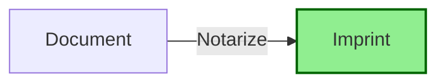
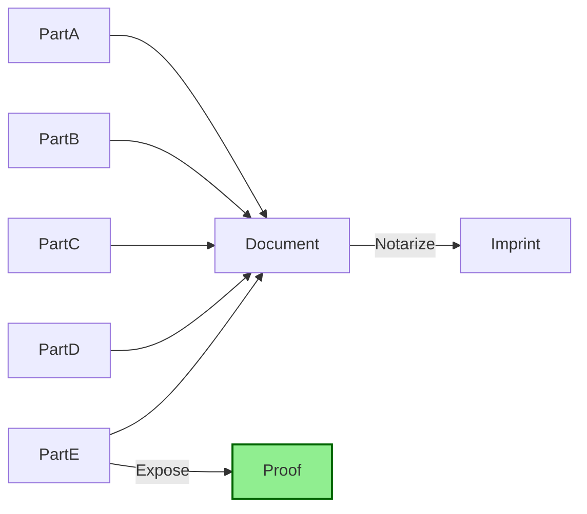
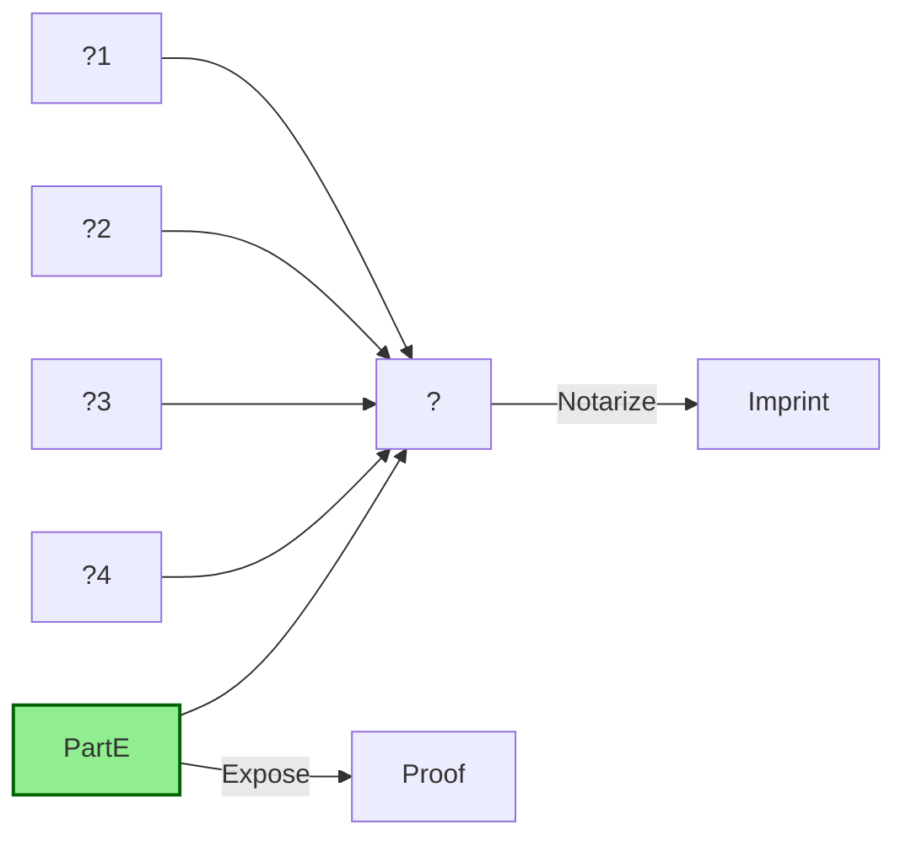
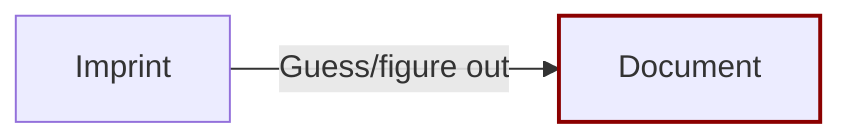
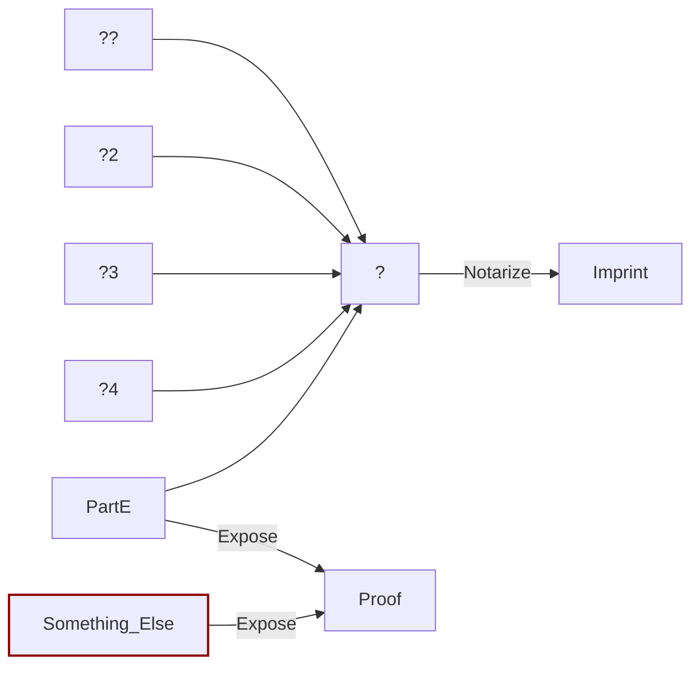
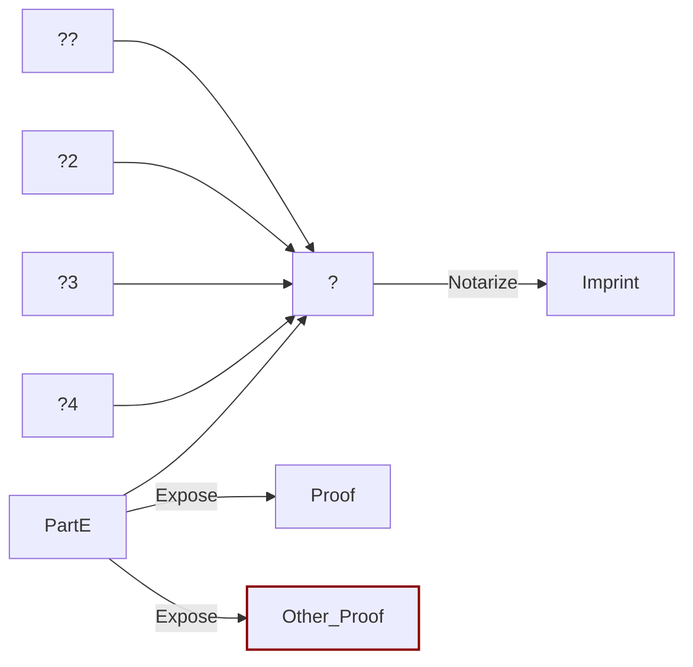

# Assurances and Threat Models

The 0xcert Framework includes a novel and efficient approach for taking arbitrary information, notarizing it, and putting the notarization on a blockchain. Doing this relies on certain cryptographic primatives and techniques and the Framework provides certain assurances.

Everybody that designs a system with 0xcert Framework should understand the system assurances so that your product is secure for the use cases you are considering. You do not need to understand cryptography to read this page, but you must have a complete understanding of your intended use case and the assurances you need to provide your end users.

## Assurances

The security of your product depends on the assurances provided by 0xcert Framework. Let's spell them out.

### 1. Any document can be notarized

Using the language of 0xcert Conventions, you can notarize any document type. This includes:

- Opaque documents — like a Microsoft Work .DOCX file
- Record — like rows in a relational database
- Structural documents — like the output of [`followers/ids.json`](https://developer.twitter.com/en/docs/accounts-and-users/follow-search-get-users/api-reference/get-followers-ids), part of the Twitter programmer interface

The person that has access to the document is able to notarize it, generating an **imprint**.

This imprint can be published as part of an Asset in the 0xcert Framework.

### 2. Any part of a document can be proved

The person that has access to the document is able to expose part of a document, generating a **proof**. This allows them to share that part with somebody else.

### 3. A proof convinces the recipient that the exposed part is true

Everyone that receives the proof will be sure that **PartE** is part of the document that has the given imprint.

And further, everyone will be sure that PartE is in a specific part of the document.

When we say "sure" this specifically means: if an attacker has all the resources of every computer on Earth and they used them for the next 10 years entirely for the purpose of convincing anybody that X (whis is not ParteE) is in this part of the document then they are very unlikely to succeed.

⚠️ This assurance depends on the security of your hash function. By default, we use the SHA-256 algorithm. And currently about 0.5% of the Earth's electricity consumption is dedicated to attacking the SHA-256 algorithm[[1]](When we say "cannot" this specifically means if that person has all the resources of every computer on Earth and they used them entirely for the purpose of this task for the next 10 years they are very unlikely to succeed. ). If you use a different hash function then your implementation may not be able to provide this strong assurance.

### 4. An imprint provides zero information about the document or its parts

If somebody has only the imprint (these are succinct, smaller than a Tweet) then they cannot reverse engineer, guess, or figure out the the original document, or any of the document parts.

When we say "cannot" this specifically means if an attacker has all the resources of every computer on Earth and they used them for the next 10 years entirely for the purpose of reverse engineering an imprint to learn any part of a document then they are very unlikely to succeed.

⚠️ This assurance depends on the security of your hash function. By default, we use the SHA-256 algorithm. And currently about 0.5% of the Earth's electricity consumption is dedicated to attacking the SHA-256 algorithm[[1]](When we say "cannot" this specifically means if that person has all the resources of every computer on Earth and they used them entirely for the purpose of this task for the next 10 years they are very unlikely to succeed. ). If you use a different hash function then your implementation may not be able to provide this strong assurance.

:bomb: TODO: Need to confirm that nonces and master keys are never reused. In other words, changing one part of a huge document will recalculate the entire Merkle proof for that document with new nonces. If not then one attack includes verifying that other parts of a document did not change. Or worse, data can be leaked if the same nonce is reused to hash a new value.

### 5. Conflicting proofs cannot be created

Nobody can create a valid proof for a part of the document which is different than the true proof for that part of the document. Also nobody can use the true proof for part of the document to convince anybody that another value, not the true value is a part of the document.

This assurance is a logical consequence of the assurances "A proof convinces the recipient that the exposed part is true" and "An imprint provides zero information about the document or its parts" above.

When we say "cannot" this specifically means if an attacker has all the resources of every computer on Earth and they used them for the next 10 years entirely for the purpose creating the conflicting proofs described above then they are very unlikely to succeed.

⚠️ This assurance depends on the security of your hash function. By default, we use the SHA-256 algorithm. And currently about 0.5% of the Earth's electricity consumption is dedicated to attacking the SHA-256 algorithm[[1]](When we say "cannot" this specifically means if that person has all the resources of every computer on Earth and they used them entirely for the purpose of this task for the next 10 years they are very unlikely to succeed. ). If you use a different hash function then your implementation may not be able to provide this strong assurance.

## Threat models

This analysis describes common scenarios and the security 0xcert Framework providers for each. By reading this, as a system designer you are less likely to rely on the Framework in ways which would make your system and your end users vulnerable.

The scenarios are ordered according to the strength of the adversary, weakest to strongest. This threat model technique is based on research published by Taylor Hornby - Defuse Security, 6 Mar 2017[[1]](https://defuse.ca/audits/gocryptfs.htm).

### Bob: the block explorer

Bob watches the entirety of transactions published on the public blockchain and your implementation publishes imprints as part of the 0xcert Framework Assets. Bob is able to see every transaction, including historical transactions, the old versions of Assets that have been modified and Assets that have been burned. Bob does not have access to any proofs.

#### Document version tracking

Bob will not be able to learn any parts of the document. However he will be able to see how often the document changes. If your application is an append-only list of information inside a document and each append operation is a blockchain transaction then Bob can accurately guess the number of items on your list by watching the number of transactions.

:bulb: Mitigation: You may create decoy transactions which modify an unimportant part of the document. This now means Bob may only accurately guess a lower bound on the list size

💡 Mitigation: You may batch transactions which modify any important parts of the document. This now means Bob may only accurately guess an upper bound on the list size.

If you use these two mitigations together then Bob is unable to make any bound on the actual list size.

### Transactor tracking

If you are using the Ethereum or Wanchain blockchains or similar, Bob will see which entity commited each transaction. This is a fundamental property of how blockchains works. If your application publishes documents which are imprinted in a 0xcert Framework Asset and a part of that document includes the identity of the publisher then Bob would be able to guess the part of the document representing the document publisher insofaras it is equal to the identity of the person performing the blockchain transaction.

💡 Mitigation: You may use an Order Gateway and claims to create Assets. In this senario, the publisher would create a claim and a separate entity (your application) would publish the transaction to the blockchain. The identity of the beneficial publisher can be hidden in several ways using this technique. The specific ways are are outside the scope of this document.

## Penny: publishes a proof 

You have exposed part of the document and created a proof, which you shared with Penny.

### Publish document parts

Penny is able to share this proof with a third party or publish it. This third party, or the public, will have access to the data. In addition, the third party or the public will be sure that this document part is authentic.

### Anonymous publishing

If you are the only person that has access to the document parts and you expose data to Penny and her friend then you will be unable to know which of the two of them published data if it is ever published.

## Sheryl: can control your cloud provider

You are running part of your application on Amazon Web Services and Sheryl has read-write access to this service.

### Read document parts

Obviously, if your document parts are stored on AWS then Sheryl can read those document parts. But below we assume your document parts are kept offline and only your asset master keys or nonces are kept on AWS.

### Brute force guess document parts

If Sheryl has access to asset master keys or nonces then she will be able to confirm if a guessed document part is correct. She can use this to brute force specific parts of your document.

### Make proofs unproveable

If Sheryl can delete the master keys or nonces then your application will not be able to expose parts from your document unless you have a backup of those master keys or nonces.

## Larry: the leaker

Larry works at your company and he has access to every document before your application notarizes them.

### Publish the documents

Obviously Larry could just publish the documents, since he has them.

### Prove the documents are authentic

Larry will NOT be able to prove the documents are authentic because he does not have access to the master keys or nonces which are used in the notarization process.
