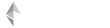

  

    The 0xcert Framework is a JavaScript library that provides <strong>a complete set of tools</strong> for building powerful decentralized applications (dapps). It enables management, digital representation, and ownership verification of <strong>unique assets </strong> such as certificates, artworks, and collectibles.
  

<a href="/guide/getting-started.html" class="button">Getting started</a>

<ul class="features">
  <li>
    <strong>Framework</strong>
    

      As a JavaScript library, the 0xcert Framework provides tools for building powerful decentralized applications (dapps). 
      <a href="/guide/introduction.html">Read more</a>
    

  </li>
  <li>
    <strong>API</strong>
    

      The platform-agnostic API provides the same functions on any distributed system you choose to build on. 
      <a href="/api/core.html">Read more</a>
    

  </li>
  <li>
    <strong>Plugins</strong>
    

      A quick access to all 0xcert API methods is enabled through a VueJS plug-in for a faster prototyping of your dapp.
      <a href="/plugins/vuejs.html">Read more</a>
    

  </li>
</ul>

<ul class="products">
  <li></li>
  <li></li>
  <li></li>
  <li></li>
</ul>

  <h4>Supported blockchains:</h4>  
  
  

